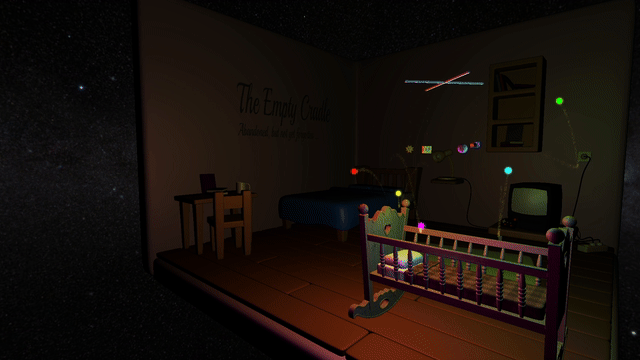

# 3D Graphics Engine

<center>



**[Click here to watch a full 60-second video demonstration on YouTube
](https://youtu.be/Oo7lQVxz5zo)**

</center>

## Overview
A custom-built 3D rendering engine developed in **C++** and **OpenGL**. This
project was designed to demonstrate high-performance rendering loops, graphics techniques, and object-oriented systems design.

This project was developed as part of my MSc in Advanced Computer Science,
receiving a final grade of **A** and specific feedback of "excellent code
structure" and of meeting the brief to a high standard.

## Core Systems Architecture
Rather than utilising deprecated immediate mode rendering, the engine is built
on a modern, highly decoupled architecture:
* **Scene Graph:** Engineered a custom hierarchical `SceneNode` graph utilising
  shared pointers. This allows parent transformations (translation, rotation,
  scaling) to cascade efficiently to descendants without redundant matrix
  recalculations.
* **Buffer Management:** Abstracted OpenGL buffers (`BufferAssembly`,
  `VertexTraits`) to handle Vertex Buffer Objects (VBOs) and Vertex Array
  Objects (VAOs) cleanly, prioritising modern triangle array rendering over
  degenerate triangles to optimise for contemporary GPU hardware.
* **Event-Driven Input:** Implemented modular Listener interfaces
  (`KeyboardListener`, `MouseListener`, `WindowListener`) completely decoupled
  from the rendering loop.

## Advanced Rendering Features
* **Instanced Particle System:** Developed a high-performance particle emitter
  utilising OpenGL instancing and billboarding. Particle states (lifetime,
  fade, positional interpolation) are updated via the time delta, allowing
  thousands of particles to render with minimal CPU-to-GPU overhead.
* **Multi-Pass Gaussian Bloom:** Implemented a customisable post-processing
  bloom effect using Framebuffers. The shader supports dynamic kernel weight
  selection (3, 5, 7, or 9-tap) allowing performance-to-quality scaling.
* **HDR Tone Mapping:** Integrated multiple tone mapping algorithms (Reinhard,
  ACES Filmic, and Uncharted2) to correctly handle high dynamic range lighting
  from emissive objects.
* **Normal Mapping:** Utilised tangent and bitangent calculations to add
  high-resolution surface detail to loaded meshes without increasing geometric
  complexity.
* **Asset Pipeline:** Integrated `Assimp` for loading complex `.obj` models and
  their associated material/texture mappings.

## Technical Stack
* **Language:** C++
* **Graphics API:** Modern OpenGL (Core Profile)
* **Shaders:** GLSL
* **Libraries:** GLFW, GLAD, GLM (Mathematics), Assimp (Model Loading),
  stb_image (Texture Loading)
* **Build System:** Make

## Build Instructions
```bash
# Clone the repository
git clone https://github.com/timclarke76/gpuProgramming.git
cd gpuProgramming

# Build the project
make

# Execute
cd assignment-02
./assignment-02
```
